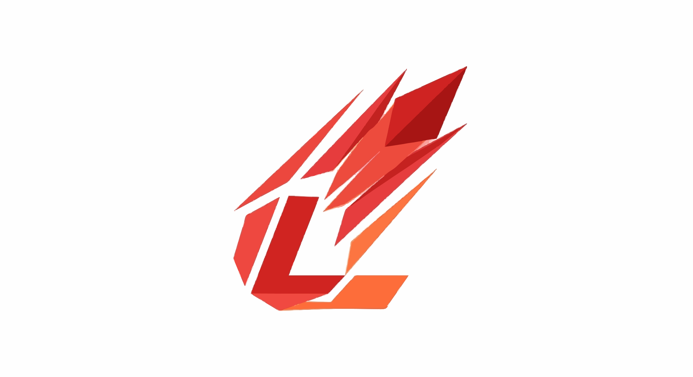

 

<h1 align="center" style="display: flex; align-items: center; justify-content: center;">
  
  umino
</h1>

### The Verified Campus & Analytics Intelligence Platform

**The next-generation AI-powered platform built for modern campuses, startups, and enterprise teams.**

 

 

[🌐 Website](https://luminohq.com) · [📖 Documentation](https://docs.luminohq.com) · [🚀 Try the Demo](https://app.luminohq.com) · [🐛 Report a Bug](https://github.com/luminohq/lumina/issues) · [💡 Request a Feature](https://github.com/luminohq/lumina/discussions)

---

## 📖 Table of Contents

- [About Lumino](#-about-lumino)
- [Why Lumino?](#-why-lumino)
- [Core Features](#-core-features)
- [Architecture Overview](#-architecture-overview)
- [Tech Stack](#-tech-stack)
- [Monorepo Structure](#-monorepo-structure)
- [Getting Started](#-getting-started)
- [Environment Variables](#-environment-variables)
- [Development Guide](#-development-guide)
- [Testing](#-testing)
- [Deployment](#-deployment)
- [Contributing](#-contributing)
- [Roadmap](#-roadmap)
- [Security](#-security)
- [License](#-license)
- [Team](#-the-lumino-team)
- [Acknowledgements](#-acknowledgements)

---

## 🌟 About Lumino

Lumino is a full-stack community, analytics, and intelligence platform that unifies your data, automates insight discovery, and empowers every member of your team to make decisions backed by real-time, trustworthy data.

In today's hyper-competitive landscape, organizations that move fast on insights win. Yet most still rely on brittle spreadsheets, fragmented tools, and siloed data that take weeks of effort to maintain. 

**Lumino was created to solve this exact problem.**

We built Lumino with a singular obsession: to make **data-driven decision making and community collaboration effortless**. From the moment you connect your first data source to when you share your first AI-generated insight report, every single interaction with Lumino is designed to be fast, intuitive, and delightful.

Lumino sits at the intersection of three powerful trends:

1. **The AI Revolution** — LLMs leverage cutting-edge AI as a deep analytical co-pilot that understands your business context, metrics, and goals.
2. **The Real-Time Era** — Live data streaming as a first-class citizen, ensuring every chart, metric, and alert reflects current state.
3. **Collaboration-First** — Every dashboard, report, and insight can be commented on, shared, and acted upon across your organization.

---

## 🤔 Why Lumino?

### 🧠 AI That Actually Understands Your Context
Ask questions in plain English (*"Why did our engagement spike last week?"*) and get answers backed by real data with an explainable reasoning chain.

### ⚡ Zero-ETL, Real-Time by Default
Connect your databases, SaaS tools, and event streams automatically. Data flows in real-time and your dashboards stay live.

### 🔐 Enterprise-Grade Security
Row-level security, end-to-end encryption, SAML/OIDC SSO, and SOC2/GDPR readiness out of the box.

---

## ✨ Core Features

- **50+ Chart Types & Visualizations**
- **Drag-and-Drop Interactive Builder**
- **Natural Language Querying (NLQ)**
- **Anomaly Detection & ML Forecasting**
- **Row-Level Security & Fine-Grained Permissions**
- **Developer-First SDKs & CLI**

---

## 🛠️ Tech Stack

| Layer | Technology |
|---|---|
| **Monorepo** | Turborepo + Bun |
| **Frontend (Web)** | Next.js 15 (App Router) |
| **Frontend (Dashboard)** | React 18 + Vite 6 |
| **Language** | TypeScript 5.9 |
| **Database** | PostgreSQL 16 + Prisma 7 |
| **Auth** | better-auth |
| **Real-time** | WebSockets + Pusher |

---

**Built with ❤️ by the Lumino team · [luminohq.com](https://luminohq.com)**

